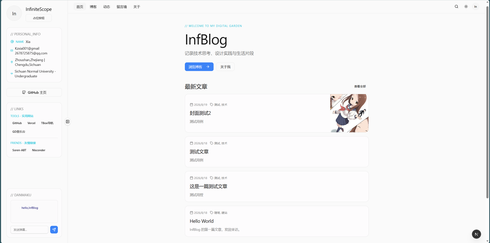
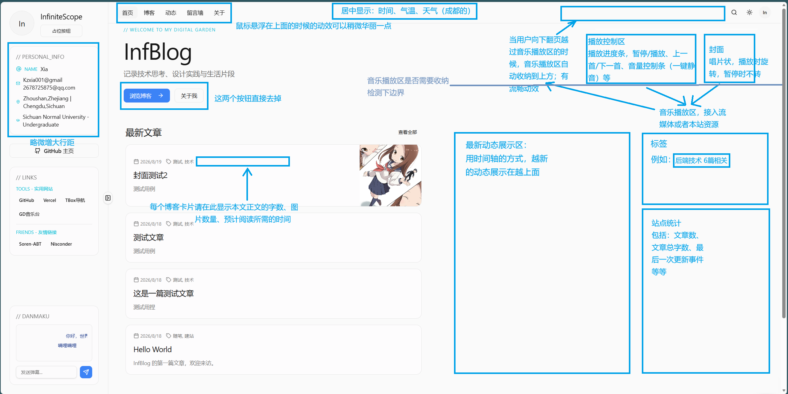
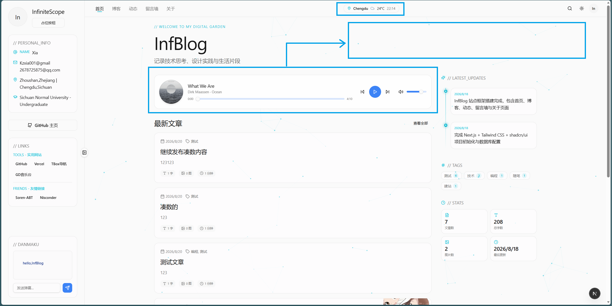
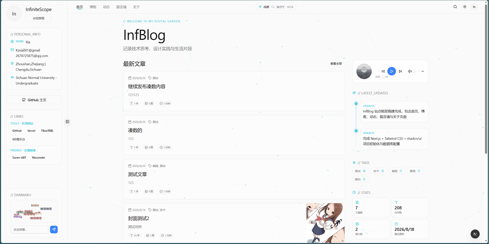
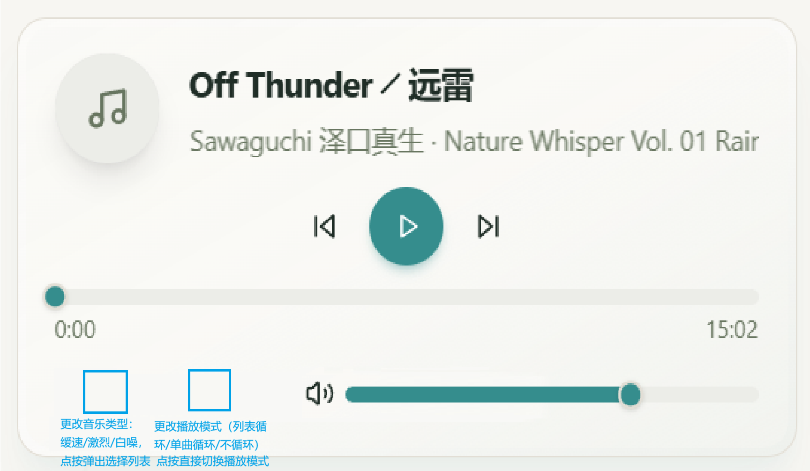

# 此文件下保存的是的过往的关键提示词
# 任何AI工具在没有明确指示或者特殊情况下，无需阅读本文档

我现在想完成一个个人博客站点，目前技术选型及网站设计纲要如下：
- 框架：Next.js,App Router
- 样式：TailWind CSS / Bootstrap ?
- 组件库：shadcn/ui / MagicUI / AceternityUI / cult/ui / FramerMotion（动画） /  ...
- 图标库：Lucide React / ...
- 字体：（待定）
- 风格：简约 / 流畅动效 / 未来风 / 工业美学（设计美学参考https://ak.hypergryph.com/ | https://www.apple.com.cn/ | https://endfield.hypergryph.com/等设计出众的网站）
- 排版布局：参考“docs\整体布局.png”
- 开发方式：AI主力 + 人工微调
现在请先载入.opencode\skills下的数个前端设计skills；然后思考这个网站设计的技术架构，与我讨论，敲定；再去网上学习https://ak.hypergryph.com/ | https://www.apple.com.cn/ | https://endfield.hypergryph.com/等设计出众的网站的设计美学（不单单是看原网站，也可以上网查找“鹰角 平面美术”，“苹果 UI设计”，“明日方舟 平面设计”等关键词进行学习）；最后将以上内容整理成PROJECT.md，其中需要包含这个项目的所有重要信息，包括技术选型、设计风格、AI开发个人博客时中的易错问题等等，放到/docs下，作为我们项目最重要的技术文档。

样式框架只使用TailWind可以；
组件库的话为什么选用shadui为主呢？其他组件库的美学设计更好吧？还是有别的考量？
动画库是好的；
博客内容形式没问题的；
部署目标我会现在本地电脑试行没问题后再部署到服务器上；
字体的话先用得意黑吧，反正调整字体比较快，但是我希望网站各个部分的字体不一样，如标题使用得意黑，博客正文、个人信息等使用更易读的字体；
弹幕功能、包括留言功能我都希望使用数据库存储，sqlite3你觉得怎么样

正文字体先使用Noto Sans SC吧，ORM使用Prisma，完成文档吧

好的，现在开始闯将项目并完成这个网站的框架吧，我希望你每次增删代码调整之后都要对功能进行自检，知道自检通过再交付对应代码；同时，注意一旦一个功能完成，及时更新对应的文档。

// 这个项目我命名为InfBlog，我希望他能成为一个开源的、支持用户快速在图形界面上修改的个人博客框架，而我自己的博客是这个框架的第一个实例。

现在请继续完善这个网站，添加书写博客、发布博客等功能，并且在首页展示最近发布的10篇博客。
对于编辑博客的功能，你有什么想法吗，比如使用什么文本编辑器？使用什么文本渲染语言？

我现在需要加入一套用户权限管理的机制以及登录系统；
首先用户的权限等级被分为三级“站长”/“管理员”/“访客”，用户可以选择登录或者注册账号（这个登录系统去网上找已有的框架吧，不要反复造轮子；用户名需长于6个字符，密码需多于6个字符，且只能包含大写字母、小写字母、数字、下划线_中的至少两类，密码在匹配时需区别大小写）；用户注册完后默认是访客，系统中预存一个站长账号（用户名为：InfiniteScope，密码为：xkz144366；注意这个账密不要硬编码在代码中，只存在数据库中）；在后台开放一个接口，允许“站长”调整用户的权限等级，即根据用户名指定将一个用户升为“管理员”或将为“访客”。
当用户登录身份为站长时，要在博客界面的右下角显示一个书写博客的按钮，点击后进入博客书写的界面；如果登录身份不是站长则不显示。
你刚刚完成的博客编辑界面我没找到在哪儿。

现在的用户登录状态不能维持（There was a problem with the server configuration. Check the server logs for more information.. Read more at https://errors.authjs.dev#autherror），在我登录到站长账号后仍然无法编辑博客；
我希望如果用户登录后，再点击右上角的“用户”按钮，会进入一个“我的”页面，这个页面下用户可以选择修改自己的昵称（昵称不等于用户名，用户在注册的时候也能选择填入自己的昵称）、密码（需要验证旧密码，站长不可以修改密码），并显示自己的权限（“访客”|“管理员”|“站长”）。

我发现新创建的博客不能点进去查看博客的详细内容；
并且现在博客不能设置封面，文章中也不能插图，请继续完善。
记住每次做完一个功能先测试一遍。

本地调试下，点击查看博客详情后会显示：404 This page could not be found.
同时设置封面图片无法正常上传且无法正常显示。

现在只要上传了封面，博客就会无法正常发布
（ POST /admin/posts/new 200 in 29ms (next.js: 5ms, proxy.ts: 8ms, application-code: 16ms)
  └─ ƒ createPost({"errors":{"coverImage":"[Array]"},"success":false}, {}) in 10ms app/admin/actions.ts
 POST /admin/posts/new 200 in 75ms (next.js: 6ms, proxy.ts: 7ms, application-code: 63ms)
  └─ ƒ createPost({"errors":{"coverImage":"[Array]"},"success":false}, {}) in 24ms app/admin/actions.ts
 GET /blog/%E5%B0%81%E9%9D%A2%E6%B5%8B%E8%AF%95 200 in 80ms (next.js: 36ms, generate-params: 7ms, application-code: 37ms)
 GET /blog 200 in 27ms (next.js: 5ms, application-code: 21ms)）

现在我希望站长在进入博客界面后能够选择删除博客，同时将博客中上传的图片从upload文件夹中删除（避免之后上线服务器后挤占服务器空间）；
在首页展示博客卡片时，我希望在卡片的右侧要显示一张缩略的封面图；
对于网站左侧的个人信息展示处，用户可以在在这个展示部分的右边缘点按收起这个栏目；
对于信息展示处，现在显示的两处Name都是NickName，我希望上方展示的NickName和下方显示的RealName要区别开来，同时将表示RealName的栏目的图标从现在的“NAME”字样换成和“邮箱”、“地址”一样风格的图标。

我希望只有站长能够删除博客，管理员不行；
同时，把NAME栏目的图标换成nick栏目的图标，然后NICK这一栏直接删了。

现在项目里把“弹幕”一词直接翻译成了“danmu”，使项目的可读性下降；请把项目中有关弹幕的文件夹名、变量名等等中的“danmu”改成“danmaku”

现在弹幕只是静止的停在原地，我希望加一个弹幕不断从右向左滚动的效果，并且弹幕的字体颜色应该在浅色模式时从比较深的颜色中选取随机颜色，并且在深色模式时直接反色，让这个弹幕功能更有弹幕网站ACG文化的感觉一点，并且保证可读性。

弹幕不需要显示时间；而且弹幕的移动速度太快了，调成随机速度，最低速度为现在的30%，最高速度为现在的50%。

每次刷新页面或者新发一条弹幕后，弹幕会现在右侧停留一会儿才会变为不可见的状态，这显然是个bug，请修复。
同时我希望给“站长”和“管理员”加上管理弹幕的功能，具体进入方式为右上角的用户按钮，站长或管理员可以选择删除某条弹幕。
对于弹幕的滚动机制要调整成这样：弹幕池先按照时序缓存50条最近的弹幕，将其滚动2遍（50条弹幕出现的顺序不固定），2遍完成后，开始从所有历史弹幕里选择弹幕进行滚动。

这个弹幕管理按钮要收录到用户界面里面，并且这个管理界面的弹幕字色默认是白色，在浅色模式下根本看不见，这个管理界面的弹幕字色应该在深色模式下是白色、浅色模式下是黑色。
关于留言墙，我希望留言墙的上部分应该渲染成留言卡片像便签一样排列，如果暂时没有留言，则显示“暂时没有留言内容哦...”；
下半部分固定为留言输入框，用户可以在下方像Bilibili（https://www.bilibili.com/）评论区那样，进行留言；当用户选择发送评论时，会弹窗让用户选择留言方式：使用昵称留言/匿名留言，如果用户选择使用昵称留言就需要让用户校验登录token，如果用户未登录，提示用户要登陆并弹出登录界面。
留言墙编辑内容允许md语法。

现在我发现一个小问题，就是每次用户登录后需要手动刷新一次后才能进入到登录状态，请优化（最好可以不刷新，实在不行就自动刷新）。
并且有个很影响体验的是，当用户未登录状态下在留言墙下留言时，一旦在选择留言方式时选择了登录，登录完成后会默认跳转到首页并且之前留言输入框中的的内容丢失；我希望用户在任何地方（之后可能也会有别的功能会接入登录的功能）登录之后，都要回到原来的界面，并且保留用户的操作记录（包括输入的内容之类）。

对于留言墙上的内容，留言的本人和“站长”可以删除留言内容。
并且现在的“弹幕管理”页面操作逻辑混乱，我的建议是把“弹幕管理”改为“管理”，里面收录所有管理内容。

现在的UI有点太素淡了，与我们之前在PROJECT.d中约定的美学设计和整体风格有点差距，所以我想进行一些大幅度的调整。
现在我们的首页，我想改进的UI布局如图。请先仔细理解一下我的改动需求，梳理一下，然后评估一下可行性以及对网站性能的影响；
对于网站的背景，我希望能仿照这个博客（https://www.cnblogs.com/yzhang-rp-inf）背景中的非规则图形的效果，请你分析一下这个博客是如何实现这种效果的，并评估一下可行性以及对网站性能的影响。

背景效果的话我希望两个都做了，右上角的用户按钮点击后多一个选项“外观设置”，允许用户选择自己喜欢的背景效果，同时也要留一个“简洁”选项，作为没有任何背景效果的选择；
天气数据源我想选用Open-Meteo，关于天气显示的地区我建议选用ipapi.co与ip-api.com竞速相应，双重保险，根据用户IP定位用户位置，显示对应位置处的天气；用户也可以点击天气，更换显示区域（搜索地区）；
音乐播放器先预留一个固定的文件夹并完成相关的代码吧，我后续上传，注意这个播放器要能够解析音频文件中内嵌的封面，要支持解码多种不同的音频格式（.mp3/.flac/.wav等），你最好上GitHub寻找相关项目和解决方案；
右侧时间轴显示内容是updates的内容，不是发布的博客，这个时间轴的呈现方式我希望能够有新意、有美学价值，你可以去GitHub或者别的网上找相关的组件进行实现。
注意，所有设计均按照PROJECT.md中的约定和相关skills完成。

如图，我在中给你看的布局，音乐播放器是在右上方的，很显然你理解错了我的意思，位置放置错了；
同时，当用户滚动超过播放器区域后，播放器不会收缩；
天气和时间显示应该居中放置；
同时，我希望当用户在其他界面时（即不在首页），音乐播放器也会自动收缩在右上角；
而且为什么你在首页展示最新博客的时候会有“字数”、“图片数量”、“预计阅读时间”的标签，到博客界面就不显示了？请调整。

你完全理解错我的意思了，你根本就没有仔细看过我发给你的图片！
这是现在的界面，你的音乐播放器的进度条和音量条无法正常显示且无法使用；音乐播放器要放到InfBlog那一行啊，如；
同时，很明显，时间天气还是没有居中，我是要全局居中，不是导航栏的居中。

音乐播放器的播放进度条现在还是无法正常拖动，并且可以拖动的音量条存在拖动时音量条不跟手的问题；
并且现在歌名、作者显示不全；
同时音乐播放器不要添加独立的收起按钮，只允许翻页或者切换界面时自动收起，并且收起后的位置应当位于顶部导航栏处，如所示；
音乐播放器的外观我希望你能去我们当时约定的MagicUI / AceternityUI / cult/ui等组件库里找；
音乐播放器这种模块在GitHub上也有不少成品的解决方案，你去学习一下人家成熟的源码，不要再出现这种小毛病了。

你先去GitHub上学习别人的解决方案，不要闭门造车，你现在闭门造出来的东西还是有bug的；
进度条还是无法拖拉，并且在首次进入首页、翻页超过播放器下沿时无法正常收纳到顶部导航栏；
音乐播放器的尺寸可以再大一点，和左侧、下方的组件对齐。

首先，你的进度条问题还是没有修复好，其次，你现在看看你这个播放器的UI设计合理吗，歌名、作者名的展示这么小一点怎么看？这个个人博客（https://furinasdiary.github.io/）里有别人做的音乐播放器模块，你好好学习下，然后重新设计！

现在音乐播放器整体上没有太大的问题了，但是尺寸有点过大了，可以将他的高度变成现在的60%，按钮等也要跟着减小一些；
现在暂停键这个组件有问题，图标看的不是很居中，请更换一个；
并且现在进度条显示当前位置的小圆点也有显示问题，他比进度条所在的位置更高，请修复。

接下来是一些细节上的调整，我希望当音乐暂停的时候，唱片状的封面不要回正，而是保持当前的旋转角度，继续播放后继续旋转；
然后是动效相关：只要触发了播放器从完整形态切换到导航栏形态（比如首页向下滚动、从首页切换到别的页面），音乐播放器就应该有一个从完整形态转化到导航栏形态的收纳动效，动画资源参考FramerMotion或者其他；
最后是易用性优化：导航栏形态下的播放器，用户除了可以点击暂停键和下一首键，也可以点击卡片的另外部分，此时音乐播放器会从导航栏向下展开成完整形态，图层最高，功能和外观与主页面上的播放器完整形态类似，方便用户在不同页面快速操作音乐播放器。

现在在网页首页没法正常向下滚动了

但是这么一搞，收纳动画没了，正好趁这次机会，选一个更优雅的收纳动画（去动画库找，尽量不要重复造轮子），原来那个动画动作有点太大了。

我感觉现在浏览器自带的上下的滚动条有点单调不美观，能否为这个博客定制一个滚动条？

现在我想开始优化我们网站的视觉效果：
现在我们网站的主题色虽然很统一，很简洁，但是我认为有点单调了，我希望我的博客主题色能够丰富一些（低饱和的深绿、藏青、大地色；现在所使用的蓝绿色等等），并且深色模式也不是简单粗暴的把黑白互换，而是一套完整的主题色方案，请你去学习相关GitHub项目然后去完善一下两套主题色的配置。
同时现在浅色模式与深色模式的切换是瞬间完成的，缺乏动效设计，我希望你去找一些比较优雅、利落、有创意的转场方式作为深浅色转化的过渡动效。

现在开始添加一些新功能：
时间显示精确到秒（我建议是设置为显示到分和显示到秒两种模式，因为后面的设计有用）；
站长可以更新“动态”，允许站长设置动态时间、动态内容等，同样通过mdx管理，可复用博客编辑的代码，同样的，站长也可以删除过往动态；
快速回顶，用户在任何页面向下翻动后，右下角会出现一个快速回顶的按钮（要有流畅的出场动效），点击后会快速回到顶部；
心流模式：放在右上角的搜索按钮的左侧，点击后，后端需要先保存下用户当前的使用偏好（如使用的背景），然后网站的背景会变成简约，时间显示变成精确到分而不是秒，网站字色、背景色变成与主题色相同色系下更加适合长时间阅读配色，如果用户在主页打开这个模式，主页左侧的个人信息会自动收起；总而言之，我设计这个心流模式是为了让用户能够进入一个更专心阅读长篇文字的状态。

“创建动态”这个按钮应该在“动态”界面也加一个。
旋转音乐播放器存在以下需要改进的点：
点击导航栏中收起的音乐播放器模块后，不会正常展开音乐播放器的完整状态，而是直接让收起状态的音乐播放器不可见；
同时我希望展开音乐播放器也不会让收起状态的音乐播放器隐藏。

现在的登录接口存在问题，具体报错如下，会导致登录状态反复刷新：
A searchParam property was accessed directly with `searchParams.callbackUrl`. `searchParams` is a Promise and must be unwrapped with `React.use()` before accessing its properties. Learn more: https://nextjs.org/docs/messages/sync-dynamic-apis
app/login/page.tsx (34:42) @ LoginPage

  32 |   const [state, formAction, isPending] = useActionState(loginUser, null)
  33 |
> 34 |   const callbackUrl = getSafeCallbackUrl(searchParams?.callbackUrl ?? null)
     |                                          ^
  35 |
  36 |   useEffect(() => {
  37 |     if (state?.success) {

现在你需要彻底检查一下登录和用户信息相关的逻辑，现在我发现这一模块存在众多问题：
首先是用户登录后还是会反复出现刷新，日志中体现为 
GET /api/auth/csrf 200 in 4ms (next.js: 1.5ms, application-code: 3ms)
POST /api/auth/session 200 in 7ms (next.js: 1.8ms, application-code: 5ms)
这两句反复出现；
其次是用户更新自己的昵称时会出现反复刷新，日志体现为
GET /api/auth/csrf 200 in 4ms (next.js: 1.4ms, application-code: 2ms)
POST /api/auth/session 200 in 6ms (next.js: 1.1ms, application-code: 4ms)
反复出现。
请修复这个问题；以后这种常犯的错误记得加到文档当中去。

我想添加显示网站浏览量的卡片，添加到我蓝色方框框起来的部分，其中显示网页总浏览量、网页近7日浏览量、今日浏览量，数字显示组件可以参考MagicUI/AceternityUI等组件库中比较美观且符合我们网站视觉风格的组件。

现在我想修改音乐播放器的UI，这个UI修改主要是缩短了音量调整条的行程并添加了两个新功能，如所示，请先认真观察一下这新的布局；
然后是这次更新后，音乐播放器的音乐目录需要分成缓速（soothing）、激烈（intense）、白噪（white-noise）三个目录，但是封面提取和封面显示保持不变；
相关图标和组件去根据docs/PROJECT.md中约定的风格和组件库中寻找。

首先，不循环的意思是放完这一首就停止播放音乐了，所以你现在写的代码逻辑和选用的图标有错误；
其次，我希望如果一个用户是第一次进入我的博客，他的音乐集默认是“缓速”，且第一首播放的歌一定是“What We Are”（这是我们这个博客的印象曲）；
最后我有个问题，这个音乐播放系统在我播放高质量音源的时候性能占用如何，我这个博客马上要上线了。

右上角显示用户登录后的头像不应该是站长的头像，而是用户自己的头像，但是我们目前没有做用户上传头像的功能，理应显示用户的默认头像。
但是我有个问题，我的个人服务器是2核心2GB、存储50GB的，平时能分配给这个个人博客的内存在700MB左右，能使用的存储在15GB左右，我如果允许用户上传头像会不会导致服务器资源紧缺？

所以综上，我最后决定用户头像就这么设计：
用户注册时可以选择时候上传头像，也可以在登陆后在右上角的用户中心选择设置自己的头像，以上两处上传头像都需提醒用户上传的头像大小不能超过10MB；然后网站再调用用户浏览器的CanvasAPI进行本地压缩，节省服务器资源，压缩到600*600的分辨率后上传到服务器。

头像设置应该收纳到个人资料里面吧；
现在未登录用户点击右上角的用户按钮后会直接进入登陆界面，而外观设置被收录在用户按钮下，但外观设置不应该只有登录的用户能用，所以我希望把外观设置分离出来成一个按钮收录在顶部导航栏、心流模式按钮的左边。

易用性设计方面，用户设置完头像或者设置完昵称后，头像设置栏和昵称设置输入框就应该立刻呈现用户当前的头像和用户当前的昵称，这样能让用户收到“我已经成功更新个人信息”的反馈。

我想在我的博客里面加一个资源分享模块，我会将一些好用的软件资源上传到网站上供用户下载，这个对服务器带宽要求是不是很高？

现在我想在个人网站顶部导航栏的“动态”和“留言墙”模块之间加一个“资源分享”模块，用以分享好用的软件、工具等等；
这个页面中会包含很多分享卡片，其简略卡片显示图标、名称、简介；用户点击后会显示分享的具体内容，包含图标、名称、简介、分享人的头像昵称、分享时间、官网链接、外部下载链接；
所有用户都可以在这个模块里上传自己想要分享的应用或工具，分享按钮放在该模块的右上角、导航栏下方，分享资源需要填入的信息就是“图标、名称、简介、官网链接、外部下载链接”这些，其中简介支持md语法，类似博客编辑器一样用mdx管理；
“站长”以及“管理员”上传的资源不需要审核直接可以显示，但是普通“访客”上传的分享资源需要经过“站长”或者“管理员”审核后才可以正常公开，在“站长”以及“管理员”的管理界面里加入一个“资源审核”的按钮，方便快速审核以及拒绝分享请求；
右上角的用户按钮点击后也要加入一个新的入口，“消息”，任何用户上传资源成功后都要在“消息”中显示“您已成功上传资源，感谢您为本站做出的贡献!请等待网站管理员审核。”，审核通过或者被拒绝都要对应的通过消息提示用户；
“站长”、“管理员”上传的资源会默认在“资源分享”中置顶，其他上传的资源根据上传时间排布，越早越靠上。

在分享资源的界面里填入图标的旁边添加一个“自动获取”按钮，可以在用户填入官网链接后爬取图标，或者让用户自己填入图片链接；
图标可填可不填，但是填入的图标要被截取成1：1的比例；
查看分享资源的详情不需要单独建立一个按钮，而是点击整个卡片直接进入查看详情。

现在缩略卡片中的简介不会以md渲染呈现；
我希望简介分为“缩略简介（30字以内，呈现在缩略卡片中，不支持md格式）”，和“详细介绍（3000字以内，呈现在详细信息中，支持md格式）”；
同时，资源分享的发布者以及站长和管理员，这三个身份的人有资格修改编辑自己发布的资源信息（包括简介、图标、名称等等）。

现在网页访问量统计的逻辑是什么。

现在我要为这个个人博客添加一点小巧思和小细节了：
1：“// WELCOME TO MY DIGITAL GARDEN”那一个标题字号调大20%，变成“// WELCOME TO
”+一些相关的名词，例如“MY BLOG”/“InfBlog”/“MY DIGITAL GARDEN”/...。并且后面显示的这些文字出现的动画选用模拟用户输入文字一样的动画；
2：“占位按钮”现在改名为“点我试试”，点击后会弹出彩色的字幕，例如“赛博功德+1”“智力+1”“源石锭+325”“DPS+799”“情商-2”这样的文字，并且按钮上的文字也会变成一些有冷幽默的字句，例如“当一天和尚，...”（无意义的点击按钮->叩门）/“从今若许闲乘月”（无意义的点击按钮->叩门）/“如果会跳出一根香蕉就好了”（致敬Banana游戏）/...
3：添加加载动画，所有需要等待加载的情况都需要添加一个加载的动画，组件从MagicUI等组件库里找。

chill-button的大小不应该是随着其中显示的文字长度变化的，而是固定的，其中的文字可以滚动显示；
然后点击出现的文字的初始x位置应该是随机的，也就是会随机左右偏移一段距离，但是这段偏移距离不超过chill-button的左右边界；
点击chill-button飘出来的文字和按钮上的文字都应该是随机的，而不是按列表顺序固定的。

你觉得我这个网站还能添加什么趣味性的内容吗？先别急着改，先和我一起想想，可以去GitHub、博客园等平台上汲取下灵感。

我觉得chill-buttun可以再绑定一点好玩的东西：
1. 按chill-button有5%的概率触发左上角站长头像碎裂（10s后回复），有5%的概率触发小火箭发射升天的动画；
2. 同时我像添加一个“网页藏品”系统，这也是个娱乐玩法，当登录用户获得第一件网页藏品之后，点击右上角的用户按钮后会多出一个“网站藏品”（图标选用奖杯），里面会展示用户所得到过的所有藏品。所用藏品使用three.js绘制，像素风的立体模型，默认自动旋转，用户可以用鼠标拖动旋转藏品。
现在添加以下藏品：
1. “Banana”: 一根普通的香蕉，点击chill-button时有1%的概率获得；
2. “BubbleBanana”: 一根金香蕉，点击chill-button时有0.1%的概率获得；
3. “Sharing?Hero.”: 一个奖杯，当用户第一次提交分享资源获得（不需要通过审核）；
4. “Listener...”: 一个挂着头戴式耳机的唱片机，当用户在网站开启音乐播放超过30min后获得；
5. “Reader...?”: 一本打开的书、书上面放着一个黑框眼镜，当用户阅读博文超过30min后获得。
站长账号登录后的右上角用户按钮中收录一个“藏品图鉴”，里面会展示全部藏品，方便我检查设计效果。

现在这个藏品系统有以下问题：
1. 当用户获得新藏品后应该将藏品展示在屏幕正中央，用户可以用鼠标拖动旋转；
2. 现在的鼠标拖动旋转事实上未实现；
3. 现在的藏品不是按中轴线旋转的；
4. 现在的藏品外形太丑了，并且像素数太少，精度低；
所以我建议你去GitHub或者其他类似bruno-simon.com那样的网站去找现成的three.js组件库、现有的开源模型、可以直接复用的解决方案等等。

现在的three.js素材在空间表现、美观程度上还是太差了，我建议使用现成的3D组件库（不太用担心笨重的问题20MB以下都可以，反正我们这个个人网站最后不会加太多藏品的），如果现成组件库实在没有我建议根据threejs系列的skills对藏品进行重绘；
同时现在有threejs这套skill了，按照这个skill的标准去自检一下现有的相关代码。

用户获得藏品时应该把藏品的模型直接展示在屏幕的正中心。

另外用户使用习惯记忆